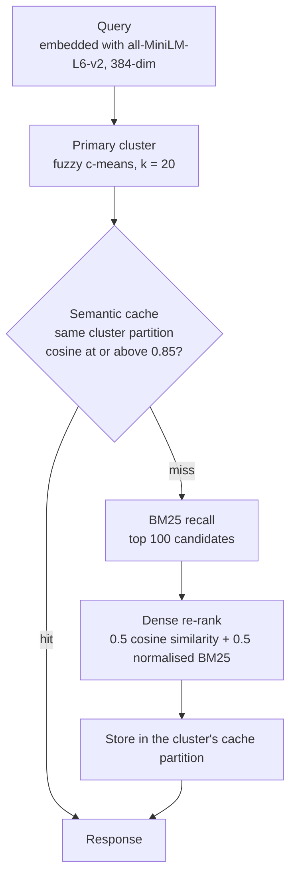
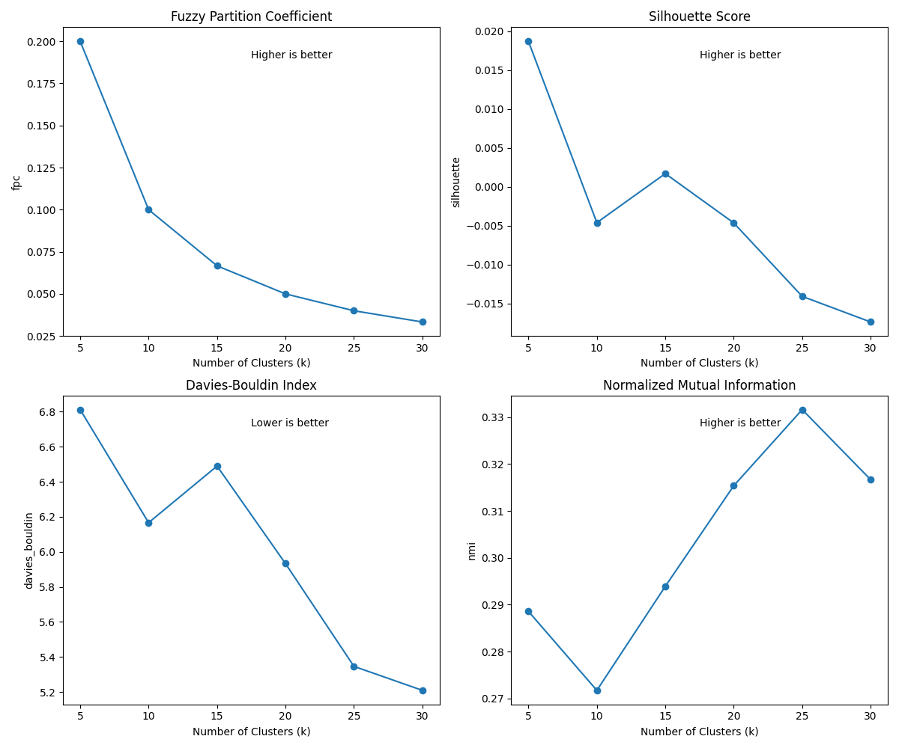

# Hybrid Semantic Search

Retrieval over the 20 Newsgroups corpus (about 20,000 documents) that routes each query to a topic cluster, checks a paraphrase-aware cache, recalls candidates with BM25 and re-ranks them with dense embeddings. Served through FastAPI and packaged with Docker.

`Python` `sentence-transformers` `FAISS` `BM25` `Fuzzy C-Means` `FastAPI` `Docker`

<p>
<picture>
  <source media="(prefers-color-scheme: dark)" srcset="docs/pipeline-dark.svg">
  
</picture>
</p>

## Why this exists

Keyword search misses documents that say the same thing in different words. Dense retrieval fixes that, but it gives up exact-term matching and repeats the same work for near-duplicate queries. This project combines the two and adds a cache that recognises paraphrases, so "NASA shuttle program" and "space shuttle launch missions" can share one answer.

## Architecture



| Stage | Module | What it does |
| --- | --- | --- |
| Ingest | `src/data_extractor.py` | Unpacks ZIP, then TAR.GZ, to plain text. Strips Usenet headers and drops documents shorter than 50 characters. |
| Embed | `src/embeddings.py` | Encodes documents and queries with `all-MiniLM-L6-v2` in batches of 64 and caches the matrix to disk. |
| Route | `src/fuzzy_clustering.py` | Fits fuzzy c-means (k = 20, m = 2) with scikit-fuzzy. Every document gets a membership vector; queries are routed by argmax. |
| Cache | `src/semantic_cache.py` | Keeps entries in per-cluster partitions. A lookup compares the query only against its own partition and hits when cosine similarity reaches the threshold. Each partition holds 200 entries and evicts the oldest. |
| Recall | `src/bm25_retriever.py` | Okapi BM25 over the corpus, returning the top 100 candidates. |
| Rerank | `src/hybrid_retriever.py` | Scores candidates by cosine similarity to the query and blends that with the normalised BM25 score at equal weight. |
| Index | `src/vector_store.py` | Builds an exact FAISS `IndexFlatIP` index over the normalised embeddings. |
| Serve | `api/main.py` | FastAPI application. Indices are loaded once at startup. |

## Design decisions

**BM25 before dense scoring.** BM25 is cheap and has high recall on exact terms. Scoring only its top 100 candidates with embeddings keeps the dense step small and keeps exact-term matches in play.

**Fuzzy clustering instead of hard clustering.** Newsgroup posts cross topics: space policy sits between `sci.space` and `talk.politics.misc`, hardware security between `comp.sys.ibm.pc.hardware` and `sci.crypt`. Fuzzy c-means keeps a membership vector per document, which makes those boundary documents visible instead of forcing them into one bucket.

**A cache partitioned by cluster.** A lookup only compares against entries from the query's own cluster. That keeps lookups small and stops an unrelated cached query from matching by accident.

**k = 20 instead of the metric optimum.** Evaluation across k = 5 to 30 put the best NMI near k = 25. The system uses k = 20 because the corpus has 20 known categories, which makes each cluster directly comparable to a newsgroup and easy to inspect through its top TF-IDF keywords.

**An exact index.** At about 20,000 vectors of 384 dimensions, `IndexFlatIP` is exact and fast enough. A larger corpus would move to an approximate index such as IVF or HNSW.

## Results

**Semantic cache**, measured on a 50-query test set:

| Similarity threshold | Hit rate | Behaviour |
| --- | --- | --- |
| 0.75 | 62% | High reuse, may answer loosely related queries from cache |
| **0.85 (default)** | **42%** (21 of 50) | Balanced |
| 0.90 | 22% | Conservative, only near-identical queries share a result |

**Cluster count**, evaluated on fuzzy partition coefficient, silhouette, Davies-Bouldin and NMI against the true newsgroup labels:

<p>

</p>

A t-SNE projection of the embeddings coloured by dominant cluster is in [`semantic_search_system/embedding_visualization.png`](semantic_search_system/embedding_visualization.png).

## API

| Method | Path | Purpose |
| --- | --- | --- |
| `GET` | `/` | Health check |
| `GET` | `/health` | Readiness: reports whether indices are loaded |
| `POST` | `/search` | Hybrid search. Body: `query` (3+ characters), `top_k` (1 to 50, default 10) |
| `GET` | `/cache/stats` | Total queries, hits, hit rate and threshold |
| `DELETE` | `/cache` | Clear the cache, or one partition with `?cluster_id=` |
| `GET` | `/clusters` | Cluster summary |
| `GET` | `/clusters/{cluster_id}/keywords` | Top TF-IDF keywords for a cluster (`?n=` 1 to 30) |

```bash
curl -X POST http://localhost:8000/search \
  -H "Content-Type: application/json" \
  -d '{"query": "NASA space shuttle", "top_k": 5}'
```

```json
{
  "query": "NASA space shuttle",
  "top_k": 5,
  "cache_hit": false,
  "primary_cluster": 7,
  "results": [
    {
      "rank": 1,
      "doc_id": "sci.space/61403",
      "bm25_score": 0.94,
      "semantic_score": 0.87,
      "combined_score": 0.905,
      "text_snippet": "The shuttle Columbia lifted off at 09:02 EST ...",
      "cluster_id": 7
    }
  ],
  "cache_stats": { "total_queries": 1, "cache_hits": 0, "hit_rate": 0.0, "threshold": 0.85 }
}
```

Interactive docs are served at `/docs` (Swagger) and `/redoc`.

## Getting started

The deployable service lives in `files/newsgroups_project/`.

```bash
cd files/newsgroups_project
pip install -r requirements.txt

# One-time: extract the corpus, embed it, build BM25 and FAISS, fit the clusters.
# If no archive is found, the corpus is downloaded through scikit-learn.
python build_index.py

uvicorn api.main:app --host 0.0.0.0 --port 8000
```

With Docker:

```bash
cd files/newsgroups_project

# One-time index build, written to the mounted ./data volume
docker-compose run --rm api python build_index.py

docker-compose up --build
```

`./run.sh` does the install, index build and server start in one step.

### Configuration

| Variable | Default | Description |
| --- | --- | --- |
| `DATA_DIR` | `./data/raw/20_newsgroups` | Extracted corpus |
| `EMBED_CACHE` | `./data/cache/embeddings.npy` | Cached embedding matrix |
| `BM25_CACHE` | `./data/cache/bm25.pkl` | Pickled BM25 index |
| `CLUSTER_CACHE` | `./data/cache/clusters.pkl` | Fitted clustering model |
| `CACHE_THRESHOLD` | `0.85` | Cosine similarity needed for a cache hit |

## Repository layout

The repository holds two versions of the system.

```
files/newsgroups_project/      The service: clean modules, index builder, API, Docker
├── api/main.py                FastAPI app and request flow
├── src/                       Extraction, embeddings, BM25, FAISS, clustering, cache
├── build_index.py             One-time index build
├── bootstrap_data.py          Downloads the corpus if no archive is present
├── WALKTHROUGH.md             Full technical write-up
└── Dockerfile, docker-compose.yml, run.sh

semantic_search_system/        The research workspace the service grew out of
├── clustering/                k selection, cluster interpretation, boundary analysis, t-SNE
├── cache/                     Cache hit-rate simulation across thresholds
├── preprocessing/             Extraction, loading, cleaning, corpus statistics
├── embeddings/, keyword_index/, vector_store/, retrieval/
└── cluster_evaluation_metrics.png, embedding_visualization.png
```

To reproduce the analysis:

```bash
cd semantic_search_system
pip install -r requirements.txt
python3 preprocessing/dataset_extractor.py && python3 preprocessing/dataset_loader.py
python3 embeddings/embedding_builder.py
python3 clustering/cluster_evaluation.py     # metrics across k
python3 clustering/run_clustering.py         # fit the final clusters
python3 clustering/boundary_analysis.py      # documents that straddle topics
python3 cache/cache_analysis.py              # hit rate at 0.75, 0.85, 0.90
```

## Limitations and next steps

- The fuzzy partition coefficient sits at 1/k for every k tested, which means memberships are close to uniform in 384 dimensions with m = 2. Routing by argmax still works, but the soft memberships carry less information than they should. A lower fuzzifier, or reducing dimensionality before clustering, is the next experiment.
- The cache was evaluated on 50 queries. A larger and more varied query log would give a tighter estimate.
- Retrieval quality is not yet scored against relevance labels. Adding recall@k and nDCG would allow the hybrid ranker to be compared with BM25 and dense retrieval on their own.
- The BM25 and semantic weights are fixed at 0.5 each and have not been tuned.

---

Built by [Yogdeep Benchimath](https://github.com/Yogdeep2004). More work on the [portfolio](https://deepwork-systems.vercel.app/).
